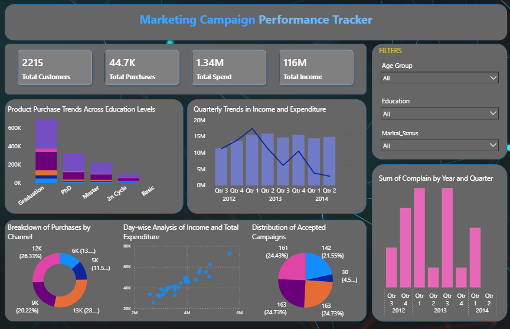

# Marketing Campaign Performance Tracker 📊

This project is a **Power BI dashboard** built on a marketing dataset.  
It analyzes **customer demographics, income, spending behavior, and campaign effectiveness** to provide insights for targeted marketing strategies.  

---

## 🚀 Project Overview
The goal of this project is to perform **analyze campaign performance metrics** and uncover spending patterns using demographic and transactional data.  
With these insights, marketing teams can identify high-value customers, optimize campaign efforts, and make data-driven decisions.  

---

## 📂 Dataset
The dataset contains customer details such as:  
- **Demographics** → Age, Marital Status, Education  
- **Income & Spending** → Annual Income, Total Spend, Product Categories Purchased  
- **Campaigns** → Acceptance of promotional campaigns  
- **Customer Since** → Date of enrollment  

Source: Provided as `marketing_data.csv` (for demo/learning purposes).  

---

## 🔑 Key Features in the Dashboard
- **KPI Cards**
  - Total Customers  
  - Total Purchases  
  - Total Income  
  - Total Spend  

- **Visuals**
  - 🥧 Donut Chart → Breakdown of Purchases by Channel  
  - 📊 Bar Chart → Sum of Complain by Year and Quarter 
  - 📅 Line and column Chart → Quarterly Trends in Income and Expenditure
  - 📅 Line and column Chart → Product Purchase Trends Across Education Levels 
  - 🎯 Pie Chart → Distribution of Accepted Campaigns
  - 📅 Scatter chart → Day-wise Analysis of Income and Total Expenditure  

- **Filters (Slicers)**
  - Age Group  
  - Education Level  
  - MArital Status Level  

---

## 🚀 Dashboard Preview

---

## 💡 Insights from the Dashboard
- Premium customers (high income, high spending) form the most profitable segment.  
- Younger customers (18–35) show higher acceptance of promotional campaigns.  
- Wine and meat products are the most popular categories across all education levels.  
- Spending patterns increase during specific quarters, highlighting seasonal trends.  

---

## 🛠️ Tools & Technologies
- **Power BI** → Dashboard design & visualizations  
- **Power Query (M)** → Data cleaning & transformation  
- **DAX** → Calculated columns & measures  
- **GitHub** → Project showcase  

---

## 🌟 Future Improvements
- Build a machine learning clustering model (K-Means) in Python for advanced segmentation.  
- Automate data refresh using Power BI Service.  
- Add more real-world marketing KPIs (Customer Lifetime Value, Churn Prediction).  

---

## 🔗 Connect with Me
👤 **Manjunath Darshan R**  
📧 [manjudr2018@gmail.com](mailto:manjudr2018@gmail.com)  
💼 [LinkedIn](https://www.linkedin.com/in/manjunathdarshanr/)  

---

✨ *If you like this project, don’t forget to ⭐ the repo!*  
